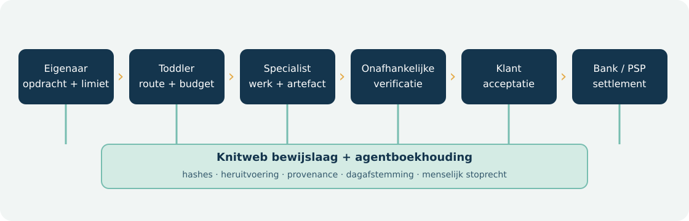
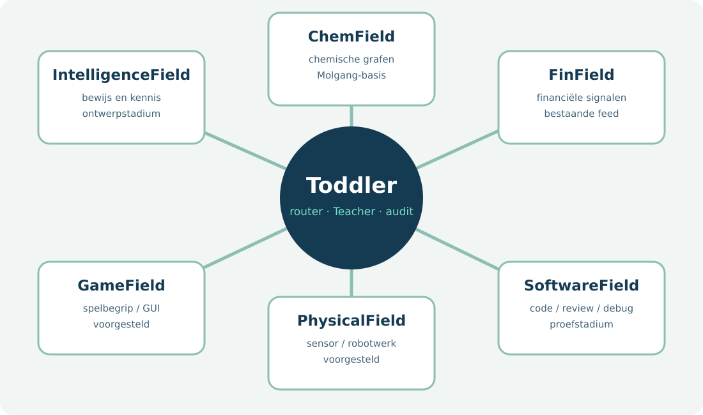
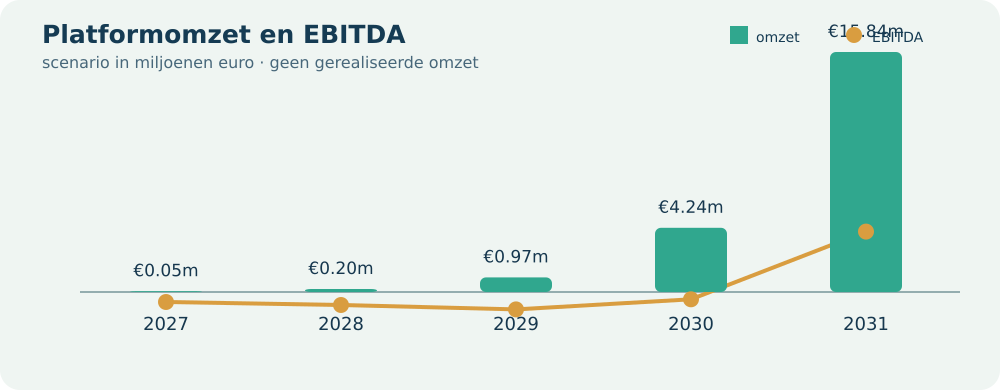

# Virtuanalytica · Toddler-agenteneconomie

**Ondernemingsplan en lean validatieprogramma · versie 0.1 · 11 oktober 2026**  
**Periode:** 2027–2031 · **Valuta:** nominale euro exclusief btw · **Status:** hypothesen en technische bewijsstukken, geen gerealiseerde omzet.

## 1. Samenvatting en investeringsstelling

Virtuanalytica ontwikkelt Toddler als bestuurbare basis voor specialistische agenten. De klant neemt het economische eigenaarschap van een agentportefeuille: hij bepaalt taak, data, toegestane middelen en budget, en ontvangt de opbrengsten van geaccepteerd werk. De software-agent zelf is geen Nederlandse rechtspersoon. De platformexploitant levert software, routering, verificatie, audit en een markt voor betaald werk. De eerste verkoopbare rol is software-debugging, onder een afgeschermde, gepaarde toets en daarna een betaald pilotproject.

De kernmaat is **gemiddeld actief betaalde agenten**, niet het aantal aangemaakte profielen of bankrekeningen. Het illustratieve scenario groeit van 5 betalende eigenaren en 25 actieve agenten in 2027 naar 100 eigenaren en 16.000 agenten in 2031. Dat vergt in 2031 9,6 miljoen geaccepteerde opdrachten van gemiddeld €10. De bijbehorende €96 miljoen bruto werkwaarde is omzet van de agent-eigenaren; Virtuanalytica telt alleen het 10%-platformaandeel, licenties, eigenaarabonnementen en diensten rond fysieke cellen als eigen omzet. De berekende platformomzet is €15,840 miljoen en EBITDA €3,988 miljoen in 2031. Dit is een ambitieus scenario, geen verkoopprognose met gemeten conversiekans.

Het grootste open risico is onvoldoende betaalde vraag per agent. Het tweede is de werkelijke kostprijs van verificatie, betalingen en menselijke correctie. Daarom worden investeringen vrijgegeven in tranches na aantoonbaar geaccepteerd betaald werk. De huidige navigatie-G4 bewijst geen commerciële, cognitieve of fysieke competentie.

## 2. Ondernemer, onderneming en juridische vorm

Deve Luse is de initiatiefnemer van het Toddler-concept. De technische uitgangspositie bestaat uit een open codebasis, Teacher-trials, een afgeschermde G4-navigatieaudit en prototypes voor kennisgrafen en Knitweb-verificatie. Een biografie, juridisch eigendomsschema, contracten, getekende klantbrieven en een bestuur met onafhankelijke bevoegdheden zijn in dit plan **nog niet geverifieerd**; deze stukken worden vóór financiering of een publieke dienst toegevoegd. Het plan noemt Virtuanalytica als werknaam voor het platform, niet als bewijs van een specifieke huidige contractpartij.

Een privé-eigenaar kan voor begrensde, laag-risicoagenten werken vanuit een eenmanszaak. Bij wezenlijke contractuele, financiële of fysieke blootstelling hanteert het productbeleid een B.V. of andere passende rechtspersoon, met verzekering, bevoegdheden en risicolimieten. Eén B.V. per agent is niet de standaard. Voor publieke afnemers blijft de agent in beginsel een budget- en auditunit van de bestaande overheid. Alleen een reële gezamenlijke taak kan een vereniging, stichting, coöperatie of publiek samenwerkingsorgaan rechtvaardigen. Een Nederlandse stichting mag één bestuurder hebben; drie door dezelfde persoon beheerste entiteiten leveren geen onafhankelijke besluitvorming op. Zie de [juridische en bancaire beslisnota](../roadmap/AGENT_OWNERSHIP_AND_BANKING.md).

## 3. Probleem, klant en waardepropositie

**Startsegment:** kleine software- en datateams, zelfstandig opererende experts en privacygevoelige onderzoeksorganisaties die veel herhaalbare taken hebben met een objectiveerbaar resultaat. Hun bestaande alternatief is menselijk werk, een code-assistent of een algemeen model met handmatige controle. Hun probleem is de totale kostenpost van taakselectie, foutopsporing, controle, privacy en herstel.

**Eerste aanbod:** een debugger-agent die binnen een geïsoleerde repository werkt, een reproduceerbare fout herstelt, tests laat slagen en een controleerbare patch oplevert. De klant beoordeelt dezelfde taken in drie armen: bestaande werkwijze, Toddler + Teacher en Toddler + Teacher + specialist. De uitkomst is het percentage geaccepteerde patches, menselijke minuten per geaccepteerde patch, totale eurokosten, doorlooptijd, systeem-kWh en kritieke fouten. De definitie van “beter” wordt vóór de proef vastgezet.

**Waardepropositie:** een specialist die werk aflevert met herkomst, terugdraaibaarheid, bevoegdheidsgrenzen en onafhankelijke acceptatie. De eigenaar behoudt de operationele regie en de economische opbrengst. Virtuanalytica verdient aan software en bewezen distributie van betaald werk. Latere ChemField-, FinField-, game- en fysieke rollen krijgen eigen private toetsen en licentiegrenzen; zij delen wel de auditlaag.

## 4. Lean canvas en toetsbare aannames

| Bouwsteen | Hypothese v0.1 | Eerstvolgende toets |
| --- | --- | --- |
| Probleem | Reproduceerbaarheid en controle kosten meer dan modelinference | 20 probleeminterviews met taakartefacten en kostentijd |
| Segment | Zelfstandige experts en privacygevoelige teams willen zelf agenten beheren | 2 betaalde designpartners uit verschillende segmenten |
| Unieke waarde | Eigenaar beheert en exporteert een agent met onafhankelijk geverifieerd werk | Voorkeursproef tegen bestaande workflow |
| Oplossing | Toddler-runtime + Teacher + specialist + bewijs + agentboekhouding | 100 gepaarde afgeschermde debuggertaken, daarna live pilot |
| Kanalen | Open source, technische casussen, integrators, gerichte direct sales | Conversie per kanaal en acquisitiekosten |
| Omzet | €6.000/eigenaar-jaar + €240/actieve agent-jaar + 10% van geaccepteerde werkwaarde | Getekende prijsproef en eerste geïnde factuur |
| Kosten | Product, verificatie, inference, betaalverkeer, support en verzekering | Directe kosten per geaccepteerde opdracht |
| Sleutelcijfers | Actieve betaalde agenten, acceptatie, netto eigenaaropbrengst, platformmarge | Maandelijks cohortdashboard |
| Moeilijk te kopiëren | Gecontroleerde lineage, private evaluatie en vakspecifieke kennisgrafen | Onafhankelijke herhaling door derde partij |

De canvas is een reeks gedateerde hypothesen. Elke mislukte proef moet de product- of groeiveronderstelling wijzigen, niet achteraf de slagingsgrens. Deze aanpak sluit aan bij de [Business Model Canvas-methode](https://www.strategyzer.com/library/the-business-model-canvas) en de [KVK-onderdelen van een ondernemingsplan](https://www.kvk.nl/starten/een-ondernemingsplan-maken-hoe-doe-je-dat/).

## 5. Markttrends en concurrenten

De relevante marktsignalen zijn activiteit-gebaseerde agentprijzen, door mensen begrensde machinebetalingen en toenemende vraag naar auditbare AI. [Salesforce Agentforce](https://www.salesforce.com/agentforce/pricing/) verkoopt acties/conversaties via credits; [Microsoft Copilot Studio](https://learn.microsoft.com/en-us/microsoft-copilot-studio/billing-licensing) factureert agentactiviteiten via Copilot Credits. [Stripe MPP](https://stripe.com/blog/machine-payments-protocol) laat agenten binnen betaalmachtigingen API-diensten inkopen. [Olas](https://docs.olas.network/) en [Virtuals](https://whitepaper.virtuals.io/) tonen markten en tokenmechanismen rond agenten. Gepubliceerde prijsmodellen bewijzen **niet** dat deze ondernemingen winst maken of dat tokenhandel samenvalt met omzet uit geaccepteerd werk.

| Alternatief | Sterk punt | Te toetsen ruimte voor Toddler |
| --- | --- | --- |
| Algemene code-assistent / cloudagent | Direct bruikbaar, groot distributienet | Lokale privacy, export, eigen eigenaarschap en onafhankelijke toets |
| Enterprise-agentplatform | Integraties en billing op schaal | Kleinere zelfstandige eigenaar, modelkeuze en auditeerbare kost per agent |
| Los open model op eigen hardware | Controle over model en data | Minder orkestratie-, toets- en betaalinfrastructuur |
| Token-agentmarkt | Wereldwijde coördinatie en economische prikkels | Scheiding tussen speculatie en geaccepteerd euro-werk |
| Menselijke specialist | Context, verantwoordelijkheid en flexibel oordeel | Alleen vervangen bij bewezen kwaliteit, tijdwinst en terugvaloptie |

Robotproducenten tonen mogelijke dienstmodellen, maar de basisberekening koopt geen vloot en veronderstelt geen mensgelijk robotwerk. Publieke AI-inzet heeft aanvullende controle-, transparantie- en soms impactbeoordelingsplichten; dit is een afzonderlijke verkooproute.

## 6. Productarchitectuur en bewijsstroom

Een eigenaar definieert opdracht, stopvoorwaarden, maximaal budget en toegestane gegevens. Toddler kiest een lokaal model of specialist binnen die grenzen; Teacher levert training en kwaliteitsreviews, niet het enige eindoordeel. Een onafhankelijke verifier toetst de artefacten. Alleen een geaccepteerde opdracht wordt gefactureerd. Een vergunninghoudende PSP of bank verzorgt de geldstroom; Virtuanalytica bewaart een eigen, per-agent dubbel-entry auditboekhouding en ontvangt zijn overeengekomen commissie. Elk modelantwoord, menselijk besluit, energiegetal en betalingsbewijs krijgt een bron- en versiekoppeling.

De productlagen zijn: (1) eigenaarschap en toegang, (2) taakrouter en specialist, (3) bewijs en onafhankelijke acceptatie, (4) betaling en reconciliatie, (5) kennisvelden, (6) optionele gedistribueerde compute via Knitweb. Het ontwikkelen van een nieuwe generatie verandert niet automatisch de juridische of betaalbevoegdheid van bestaande agents.

## 7. Knitweb als compute- en bewijsinfrastructuur

Knitweb is een bestaande peer-to-peer codebasis met onder meer signed-feed replicatie, content-addressed Fiber, PoUW-verificatie en een synaptic bundle. Toddler gebruikt al de lokale/peer-keuze in `toddler/relay.py`: de router vergelijkt berekende kosten en energie, weigert een peer wanneer fraude economisch loont en neemt een peerresultaat pas na steekproefsgewijze heruitvoering. De bronmodule `toddler/_knitweb.py` vindt een geïnstalleerde package of sibling checkout. De kennisgraaf kan via `toddler/knowledge/publish.py` naar een deterministische, voorlopig ongetekende synaptic bundle worden omgezet.

**Zakelijke toepassing:** laat een klant optioneel een afgebakende inferentie- of verificatietaak naar een Knitweb-spider uitbesteden; leg specificatie, inputs, prijsplafond, outputhash, steekproef en verdict vast. Een chemicaliënagent kan een publieke ChemField-graaf raadplegen en een onafhankelijke rekenproef laten uitvoeren. Een fysieke waarneming kan later een PAR-bounty ondersteunen. PLS en PAR zijn geen verplichte klantbetaling en krijgen nul omzet in het basisscenario. Privacygevoelige ruwe input blijft lokaal tenzij de eigenaar en het contract uitbesteding toestaan.

**Go/no-go:** de peer-route moet op dezelfde taak lagere totale eurokosten of kWh per geaccepteerd resultaat halen zonder slechtere betrouwbaarheid, latency of gegevensbescherming. De huidige PoUW- en grafverbindingen zijn techniekbewijs; er is geen live grootschalige marktplaatsmeting.

## 8. De velden: gespecialiseerde kennis met eigen grenzen

| Field | Bestaande bron | Eerste betaalbare uitkomst | Afgeschermde toets |
| --- | --- | --- | --- |
| IntelligenceField | Ontwerp voor provenance en algemene kennis; geen zelfstandige productie-repo vastgesteld | Onderzoeksnotitie met controleerbare bronnen | Brondekking, feitencontrole, antwoordkwaliteit |
| ChemField | Molgang `chemfield.py` en provenance-graaf bestaan; browser- en vrijgavebestanden zijn prototypes | Chemische datareconciliatie of simulatieverslag | Massabalans, bronherkomst, bekende reactie-uitkomst |
| FinField | `finfield-feed` en `finfield-web` bestaan | Datakwaliteit, signal-uitleg, geen autonoom beleggingsadvies | Tijdsplit, leakage-test, kosten, fout-negatieven |
| GameField | Toddler-game specialist is voorgesteld; geen bewezen GTA- of consoleagent | Game-debugging en UI-testen binnen toestemming | Nieuwe levels, tijd tot doel, regels en ToS |
| PhysicalField | Toddler-fastpath en sensorgebaseerde veiligheidsarchitectuur zijn prototype | Geassisteerde inventarisatie, pas na fysieke pilot | Sensorfouten, stoplatency, incidentvrije uren |
| SoftwareField | Debuggerpilotscorer bestaat, maar nog geen klantresultaat | Geaccepteerde patch met tests | Verzegelde taken en prospectieve klantacceptatie |

Een field is een **versiebeheerde kennis- en bewijsruimte**, geen bewijs van PhD-niveau. Elk field bewaart bronnen met licentie en datum, code- en claimrelaties, testcases, foutgeschiedenis en afgestemde eigenaarstoegang. Toddler gebruikt een gedeelde router en evidence-schema, maar elk field heeft eigen verifier, risico en commerciële activeringspoort. De kaart toont ook beoogde velden; hun getekende aanwezigheid is geen operationele status.

## 9. Operationeel plan: van taak tot betaalde dienst

**Productieproces.** 1) Een eigenaar registreert de rol en accepteert voorwaarden; 2) de operator verifieert identiteit en eigenaarschap van data; 3) de taak krijgt een meetbare acceptatieregel en bevoegdheidsprofiel; 4) een kandidaat-agent doorloopt publieke ontwikkeling en daarna onafhankelijke, afgeschermde promotie; 5) bij een klant start een schaduwfase zonder schrijfrechten; 6) betaald werk wordt pas na klantacceptatie en verifierbewijs gefactureerd; 7) betaling loopt via een toegelaten PSP; 8) de agentboekhouding wordt dagelijks met bank/PSP afgestemd; 9) incidenten en afwijkende scores leiden tot pauze of terugval naar de vorige versie.

**Rollen.** De eigenaar bepaalt doel, budget en uiteindelijke acceptatie. Teacher traint kandidaten en kan feedback leveren. De onafhankelijke evaluator beheert de verzegelde toetsset en bevestigt resultaten. De platformoperator beheert runtime, incidenten en privacy. De betaalpartner verwerkt geld. Voor fysiek werk is er bovendien een locatieverantwoordelijke met onmiddellijk stoprecht. Een enkele persoon kan in de allereerste prototypefase meer dan één rol uitvoeren, maar de onafhankelijke promotietoets mag niet worden vervangen door dezelfde prompts waarop is getraind.

**Dienstniveaus voor pilotontwerp, nog niet verkocht:** per taak een maximale looptijd en budget; 100% artifact- en versiehashes; dagelijkse balansafstemming; terugdraaiing binnen één werkdag voor digitale artefacten; onmiddellijke blokkade van credentials bij een ernstig incident. Beschikbaarheid, reactietijden en schadeplafonds worden pas contractueel beloofd na load- en herstelmetingen.

| Eerste 90 dagen | Leverbaar bewijs | Stop of herstel |
| --- | --- | --- |
| Week 1–3: twee probleem- en prijsinterviews per week | Reële taakverdelingen, historische correctieminuten en betaald budget | Geen duidelijke inkoper: segment herzien |
| Week 2–6: 100 gepaarde private debugopgaven | Acceptatieverschil, interval, reviews, energie en fouttypen | Geen kwaliteitswinst: agent niet promoten |
| Week 5–9: schaduwprojecten bij twee eigenaren | Voldoende autorisaties, geen verborgen productiewrites | Scope of sandbox aanpassen |
| Week 8–12: betaald pilotcontract | Geïnde factuur, netto eigenaarwaarde en platformbijdrage | Geen positieve marge: herprijs of stop |

## 10. Marketingplan en verkoopmachine

**Positionering:** “Uw agent, uw werk en uw opbrengst, met controleerbaar bewijs.” Deze claim geldt slechts voor contractueel toegekende rechten; het platform houdt zijn eigen software en extern gelicentieerde modellen. De marketing toont een hele taak met begintoestand, patch of analyse, verifier, menselijke correctie, kWh en rekening. Geen benchmarkscore wordt als gerealiseerde klantbesparing voorgesteld.

**Kanalen en funnel.** Open-source documentatie en reproduceerbare technische casussen trekken ontwikkelaars; gerichte gesprekken met teamleiders leveren designpartners; integrators brengen later specifieke privacy- of robotsectoren binnen. Een geïnteresseerde wordt pas “lead” na benoeming van budgethouder en taakset. Een pilot wordt pas “gewonnen klant” na betaald contract. Een agent is pas “actief betaald” na geaccepteerd, gefactureerd werk. Publiceer per kanaal het aantal benaderde organisaties, probleemgesprekken, gekwalificeerde leads, betaalde pilots en terugkerende eigenaren, telkens met periode en noemer.

**Prijsproef:** toets €6.000 per eigenaar-jaar, €20 per actieve agent-maand en 10% commissie. Laat twee eigenaren daarnaast een keuze maken tussen lagere licentie/hogere commissie en hogere licentie/lagere commissie. Meet totale netto waarde, niet alleen bereidheid om verbaal een prijs te accepteren. Robotcellen krijgen een aparte offerte na een veiligheidscasus; een prijs van €72.000 per jaar is slechts de modelaanname.

**Twaalfmaands communicatie:** elk kwartaal één onderbouwde technische case, één onafhankelijk herhaalde vergelijking en één feedbackronde met bestaande eigenaren. Vermijd onbewezen claims over “human-level”, autonoom ondernemerschap of algemene PhD-kwaliteit. Voor overheden een aparte procurement- en impactbeoordelingsdossier, zonder een vereniging als verkooptruc.

## 11. Organisatie, beveiliging en compliance

Voor de eerste pilots zijn de minimale verantwoordelijkheden: product- en modelengineering, evaluatiebeheer, beveiliging/incidentrespons, klantoperatie en financiële reconciliatie. Een oprichter kan taken combineren, maar kritieke goedkeuringen moeten via aparte credentials en controleerbare logs verlopen. De staffing- en salarismix onder de operationele kosten wordt pas ingevuld na twee pilots; het plan verzint geen huidige werknemers.

Agentmachtigingen zijn taakgebonden en verlopen. Nieuwe betaalontvangers, contracten, investeringen, publicatie van persoonsgegevens en fysieke actuatie blijven onder menselijke goedkeuring. Elke agent heeft een afzonderlijke audit- en boekhoudidentiteit, maar bankrekeninghouder blijft de KYC-gecontroleerde klant of rechtspersoon. Knab publiceert vijf zakelijke rekeningen; bunq Pro Business 25 met een extra bundel; Revolut Grow biedt een Business API; N26 Business noemt B2B-betalingen ongeschikt. Dit zijn pilotopties, geen bevestiging van grootschalige agentrekeningen. [Bankvergelijking en rechtsvormmatrix](../roadmap/AGENT_OWNERSHIP_AND_BANKING.md).

Volgens [DNB](https://www.dnb.nl/voor-de-sector/open-boek-toezicht/wet-regelgeving/psd2/elektronische-handelsplatformen-e-commerce-platforms-psd2/) kan een marktplaats die zelf kopersgelden ontvangt en verkopers betaalt vergunningplichtig zijn. Het basisontwerp gebruikt daarom een gereguleerde betaalpartner zonder klantgelden in de gewone Virtuanalytica-exploitatierekening. Publieke hoogrisicotoepassingen vragen volgens de [Autoriteit Persoonsgegevens](https://autoriteitpersoonsgegevens.nl/actueel/de-fria-voor-ai-systemen-komt-eraan-bereid-u-voor) extra grondrechtenbeoordeling wanneer de specifieke plicht van toepassing wordt.

## 12. Financieel plan I: omzet en exploitatie

**Rekenregel:** eigenaarabonnementen + actieve agenten × €240 + actieve agenten × 50 geaccepteerde opdrachten/maand × 12 × €10 × 10% + actieve partnercellen × €72.000. Het derde deel is een commissie op de werkwaarde van de eigenaar; bruto werkwaarde zelf is geen platformomzet. Directe-kostenhypothesen zijn 20% op eigenaarabonnementen, 30% op agentlicenties, 35% op commissies en 40% op cellen.

| € miljoen | 2027 | 2028 | 2029 | 2030 | 2031 |
| --- | ---: | ---: | ---: | ---: | ---: |
| Platformomzet | 0,051 | 0,198 | 0,966 | 4,236 | 15,840 |
| Directe kosten | 0,013 | 0,057 | 0,313 | 1,418 | 5,352 |
| Brutowinst | 0,038 | 0,141 | 0,653 | 2,818 | 10,488 |
| Operationele kosten | 0,700 | 1,000 | 1,800 | 3,300 | 6,500 |
| EBITDA | -0,662 | -0,859 | -1,147 | -0,482 | 3,988 |

De omzetmix in 2031 is €9,600 miljoen commissie, €3,840 miljoen agentlicenties, €0,600 miljoen eigenaarabonnementen en €1,800 miljoen fysieke diensten. Het model is afhankelijk van vraag per agent. Het bevat geen inkomsten uit PLS/PAR-koers, tokenverkoop of hardwareverkoop. Een onderneming kan boekhoudkundig een andere bruto/netto-omzetbehandeling nodig hebben afhankelijk van haar contractuele rol; de nu gekozen netto-commissiebenadering moet door een accountant op het uiteindelijke marktplaatscontract worden getoetst.

## 13. Financieel plan II: investering en financiering

**Investeringsbegroting, model:** €0,150m in 2027, €0,200m in 2028, €0,300m in 2029, €0,500m in 2030 en €0,800m in 2031. Dit zijn plafondenveloppen voor software, testinfra, beveiligings- en integratieapparatuur, geen onderbouwde offerteposten. Er wordt geen eigen robotvloot aangeschaft. Voor financiering moeten leveranciersoffertes, afschrijvingsschema's en btw-kasimpact worden toegevoegd.

**Voorlopige financieringsbehoefte:** het laagste cumulatieve EBITDA-minus-capex saldo bedraagt -€4,300m eind 2030. Een rekenbuffer van 25% maakt €5,375m. Dit is geen sluitende financieringsbegroting, omdat betalingstermijnen, werkkapitaal, belasting, verzekeringen, PSP-reserves en rentelasten ontbreken. De financieringsmix — eigen vermogen, klantvooruitbetaling, subsidie, schuld of partners — blijft open totdat twee betaalde pilots en een maandelijkse liquiditeitsprognose bestaan. Een subsidie wordt niet als zekere inkomstenbron geboekt.

| Jaar | Capex €m | EBITDA minus capex €m | Cumulatief €m |
| --- | ---: | ---: | ---: |
| 2027 | 0,150 | -0,812 | -0,812 |
| 2028 | 0,200 | -1,059 | -1,871 |
| 2029 | 0,300 | -1,447 | -3,318 |
| 2030 | 0,500 | -0,982 | -4,300 |
| 2031 | 0,800 | 3,188 | -1,112 |

## 14. Financieel plan III: liquiditeit en vier begrotingen

De exploitatiebegroting hierboven bevat omzet en kosten per jaar. De investeringsbegroting toont capex. De voorlopige financieringsbegroting toont een **ongevuld financieringsgat** in plaats van niet-bestaande toezeggingen. Voor de liquiditeitsbegroting wordt in 2027 een maandmodel ingevoerd met oplopende eigenaar- en agentcohorten, één maand betaalvertraging, dagelijkse PSP-afstemming en afzonderlijke momenten voor capex. Zonder die aannames zou een jaar-EBITDA ten onrechte als banksaldo worden gepresenteerd.

Het reproduceerbare maandmodel gebruikt 2–8 eigenaren (jaarsom 60 = gemiddeld 5) en 5–45 actieve agenten (jaarsom 300 = gemiddeld 25). Opex van €700.000 is gelijkmatig verdeeld; capex van €75.000 valt in januari en juli. Kosten worden betaald in de maand van het werk; klantontvangsten volgen één maand na facturatie. Alle bedragen hieronder zijn euro, exclusief btw, zonder startsaldo of financiering.

| Maand | Eigenaren | Agenten | Gefactureerd | Ontvangen | Kaseindsaldo |
| --- | ---: | ---: | ---: | ---: | ---: |
| Jan | 2 | 5 | 1.350 | 0 | -133.651 |
| Feb | 3 | 9 | 2.130 | 1.350 | -191.146 |
| Mrt | 3 | 12 | 2.340 | 2.130 | -247.931 |
| Apr | 4 | 16 | 3.120 | 2.340 | -304.700 |
| Mei | 4 | 19 | 3.330 | 3.120 | -360.760 |
| Jun | 5 | 23 | 4.110 | 3.330 | -416.804 |
| Jul | 5 | 27 | 4.390 | 4.110 | -547.162 |
| Aug | 6 | 30 | 5.100 | 4.390 | -602.410 |
| Sep | 6 | 34 | 5.380 | 5.100 | -657.043 |
| Okt | 7 | 37 | 6.090 | 5.380 | -711.565 |
| Nov | 7 | 43 | 6.510 | 6.090 | -765.519 |
| Dec | 8 | 45 | 7.150 | 6.510 | -819.200 |

De laagste maandstand is in dit scenario **-€819.200** in december; dat is €7.150 lager dan de jaarproxy door de open decemberfactuur. Afronding in de tabel is op hele euro's; de exacte centbedragen staan in `forecast_2027_2031.json`. Dit is een model, geen werkelijke bankstand. Voor een financieringsaanvraag moeten btw, loonheffing, omzetbelasting, betalingsachterstanden, verzekeringspremies en contractuele aanbetalingen nog worden toegevoegd. De vier-begrotingenstructuur volgt de [KVK-handleiding financieel plan](https://www.kvk.nl/geldzaken/financieel-plan/).

## 15. Risico, scenario's en beslispoorten

**Neerwaarts scenario:** de helft van eigenaren, betaalde agenten en cellen, met dezelfde operationele uitgaven. In 2031 resteert €7,884m platformomzet en -€1,278m EBITDA; de vijfjarige kasproxy eindigt rond -€8,208m. **Opwaarts scenario:** 1,5× volume en 1,2× operationele uitgaven geeft €23,796m platformomzet en €7,954m EBITDA in 2031. Dit zijn mechanische gevoeligheden, geen kansen.

| Risico | Vroege indicator | Beheersing en besluit |
| --- | --- | --- |
| Te weinig betaalde taken | minder dan 50 geaccepteerde €10-jobs per agent-maand | groeicurve terugzetten; andere niche of prijs testen |
| Kosten per job te hoog | platformbijdrage of eigenaarwaarde negatief na correcties | route, taak of tarief wijzigen; geen schaalvergroting |
| Geheime toets vervuild | overlap met train-/ontwikkeldata | proef ongeldig, nieuwe afgesloten set |
| Bank/PSP kan structuur niet dragen | limiet, KYC-vertraging, reconciliatieverschil | minder IBANs; eigenaarrekening plus subledger |
| Schade of onbevoegd handelen | overschrijding budget, contract of sensorlimiet | agent blokkeren, menselijke incidentleider, herstelpad |
| Publieke besluitvorming | geen wettelijke bevoegdheid of impacttoets | geen publieke productie-inzet |
| Afhankelijkheid van één model | licentie, uitval of kwaliteitsval | terugvalroute en jaarlijks portabiliteitsexperiment |

Een echte go/no-go volgt na twee betaalde pilots: herhaalbare acceptatie, geen kritieke incidenten, meetbaar lagere menselijke correctietijd, en positieve netto waarde voor zowel eigenaar als platform. De private benchmark is noodzakelijk voor modelselectie, maar het betaalde klantresultaat bepaalt de onderneming.

## 16. Uitrol 2027–2031 en meetritme

| Jaar | Scenario-doel | Vereist bewijs vóór opschaling |
| --- | --- | --- |
| 2027 | 5 eigenaren, 25 actieve betaalde agenten | debugrol, betaalde acceptatie en eigenaren die hun agent werkelijk beheren |
| 2028 | 12 eigenaren, 150 agenten | stabiele reconciliatie, herhaalbaar werk en gedocumenteerde supportkosten |
| 2029 | 25 eigenaren, 800 agenten, 2 cellen | onafhankelijke audit en fysieke veiligheid op twee begrensde locaties |
| 2030 | 50 eigenaren, 4.000 agenten, 8 cellen | kanaalconversie, supportcapaciteit en positieve cohortbijdrage |
| 2031 | 100 eigenaren, 16.000 agenten, 25 cellen | blijvende klantwaarde, revisie op gerealiseerde data en veilig opschaalbaar bestuur |

Het maandpakket laat per klantcohort zien: actieve agenten, tijd tot eerste betaalde job, geaccepteerde/afgewezen jobs, bruto eigenaarwaarde, betaalde opbrengst, netto eigenaarwaarde, platformomzet, volledige kosten, kWh, menselijke reviewminuten, geschillen en incidenten. Elk getal heeft een periode en noemer. De casus krijgt een zichtbaar onderscheid tussen gemeten, afgeleid en gepland.

## Appendix A · Modelstatistieken en formules

| Maat | Berekening | Illustratieve 2031-uitkomst |
| --- | --- | ---: |
| Agenten per eigenaar | 16.000 / 100 | 160 |
| Geaccepteerde jobs | 16.000 × 50 × 12 | 9.600.000 |
| Bruto werkwaarde eigenaren | 9.600.000 × €10 | €96.000.000 |
| Toddler commissie | 10% × €96.000.000 | €9.600.000 |
| Netto eigenaaropbrengst vóór eigen kosten | 90% × €96.000.000 | €86.400.000 |
| Agentlicentie | 16.000 × €240 | €3.840.000 |
| Platformomzet totaal | commissie + licentie + €0,600m eigenaar + €1,800m cellen | €15.840.000 |
| Brutomarge | (€15,840m − €5,352m) / €15,840m | 66,2% |
| EBITDA-marge | €3,988m / €15,840m | 25,2% |
| Financieringstrough zonder werkkapitaal | minimum cumulatief EBITDA − capex | €4.300.350 |
| Rekenkundige buffer | 1,25 × trough | €5.375.438 |

Een “betaalde agent” is een gemiddeld jaar-equivalent met werkelijk geaccepteerd en gefactureerd werk. Eén eindjaarsprofiel telt niet automatisch als één volledig betaalde agent. De scenarioaannames staan in [`forecast_2027_2031.json`](../whitepaper/forecast_2027_2031.json) en worden gegenereerd door [`forecast_toddler_business.py`](../../scripts/forecast_toddler_business.py).

## Appendix B · Statistische bewijsstatus

| Claim | Data en statistiek | Toegestane conclusie |
| --- | --- | --- |
| G3-recombined navigatie | 5 kinderen; twee onafhankelijke geheime sets; kandidaat-IQM 0,9458 / 0,9468 versus G2 0,8115 / 0,8120; p=0,00397 in beide paren | officiële navigatie-overlevende, geen software- of bedrijfsresultaat |
| G4-search navigatie | 5 kinderen; twee onafhankelijke private sets van 30 seeds; officiële status `promoted` en geverifieerde lineage | opvolger voor de geteste MiniGrid-navigatie; geen algemene competentie |
| G4 cognitieve vragen | 22/54 op eerste nieuwe private diagnostic = 40,74%; 3 items per gebied | onvoldoende voor promotie of per-gebied competentie |
| Software-debugger | scorer en protocol aanwezig, nog geen klantgeaccepteerde taken | “beter op softwarewerk” blijft onbewezen |
| Economisch scenario | aannames in code; geen geobserveerde klantconversie of betaalde-agentcohort | alleen rekenkundige sensitiviteit, geen betrouwbaarheidsinterval op omzet |

Rapporteer nooit een statistisch betrouwbaarheidsinterval op de vijfjarige omzet alsof de prijs- en vraagassumpties steekproefdata zijn. De softwarepilot gebruikt vooraf geregistreerde gepaarde uitkomsten en onzekerheidsintervallen; de omzetprognose wordt na echte cohortdata herijkt.

## Appendix C · Bronnen en reproduceerbaarheid

Technische bron: [Toddler code en publicaties](https://github.com/virtuanalytica/toddler), [Knitweb code](https://github.com/knitweb/pulse), lokale [G3-promotienota](../learn/G3_PROMOTION_20261009.md), [G4 private protocol](../learn/G4_MATCHED_PRIVATE_GATE_20261010.md), [G4 cognitieve diagnostic](../learn/G4_COGNITIVE_HOLDOUT.md), [technische paper](../technicalpaper/TECHNICAL_PAPER_G0_G4.md). Marktbronnen en bankprijzen zijn per paragraaf gelinkt en gecontroleerd op 11 oktober 2026. De financierings- en rechtsvormbesluiten vergen een concrete notaris, accountant, PSP en contractpartij; het plan registreert die afhankelijkheid in plaats van ze als afgerond te presenteren.

Reproduceer de tabellen met `python scripts/forecast_toddler_business.py` en bouw de PDF met `python scripts/build_business_plan.py`. De bouw valideert de kerngetallen tegen JSON. De appendices blijven in het bronbestand leesbaar en de SVG-logo's en schema's staan in `docs/businessplan/assets/`.
