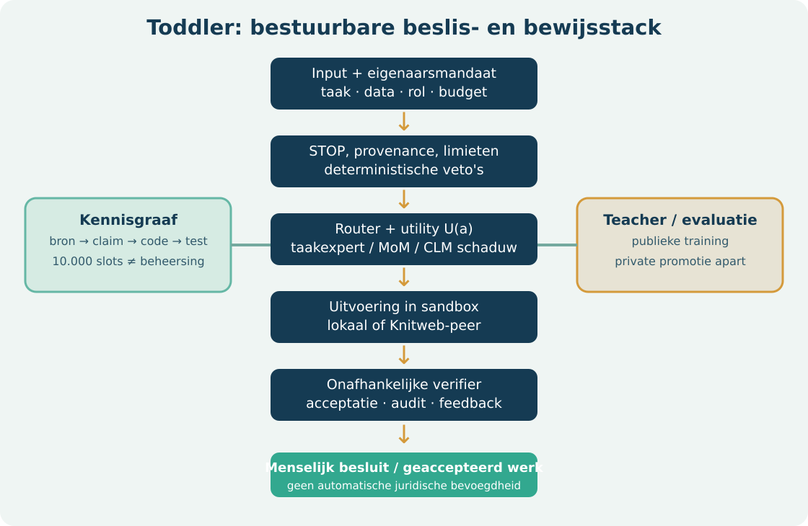
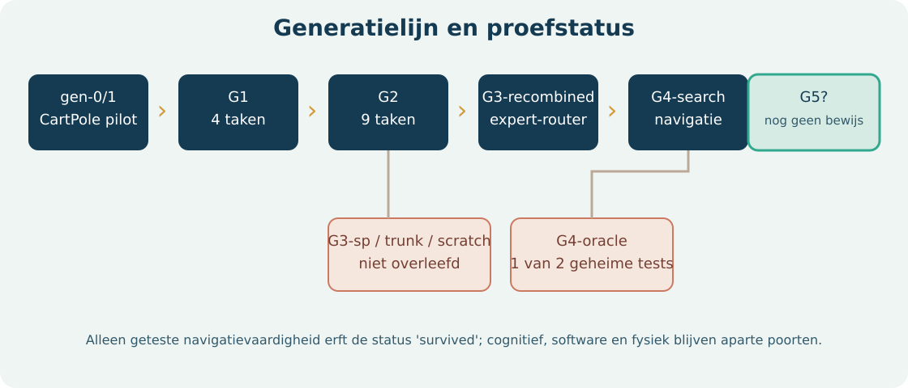
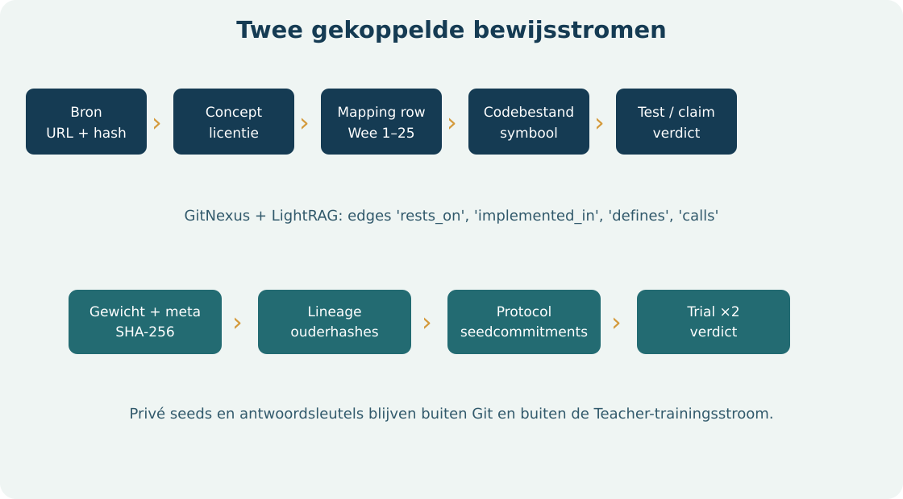

# Toddler: architectuur, leren en bewijs tot G4

**Technische paper · versie 0.1 · 11 oktober 2026**  
**Scope:** codebase `virtuanalytica/toddler`, externe Teacher- en Knitweb-componenten, officiële RL-generaties en kennisgraaf.  
**Status:** implementeerde functies en gemeten resultaten zijn gescheiden van prototypes en onderzoeksvoorstellen.


## Abstract

Toddler is een bestuurbare leeragent met harde STOP-regels, een beslisfunctie waarin beloning, kosten en risico worden gewogen, versiebeheerde policies, bron- en auditregistratie en een onafhankelijke promotiepoort. De RL-lijn begon met een CartPole-controleproef, breidde in G1 uit naar vier taken, in G2 naar negen taken, verving mislukte monolithische G3-varianten door een bevroren taakexpert-router en promoveerde op 11 oktober 2026 een oudergebonden G4-search-cohort voor navigatie. Dit bewijst geen algemeen intellect, software-ambacht of fysieke autonomie. De cognitieve G4-kop, JEV/CLM-reflex en mixture of models zijn afzonderlijke subsystemen met aparte meetgrenzen.

De paper beschrijft modules, train- en evaluatiedata, hashes, lineage, private toetsisolatie, de 10.000-adressen-capabilityatlas, LightRAG/GitNexus en een ontwikkelaarsroute om de publieke delen te reproduceren. Geheime toetsseeds en gewichten staan buiten Git; een clone kan het protocol en codepad reproduceren, maar niet de officiële private uitkomst herhalen zonder de onafhankelijke evaluator.

## 1. Claimgrenzen en systeemdoel

De beleidsfunctie van `toddler/objective.py` kiest een actie onder harde STOP-beperkingen. Het ontwerp gebruikt de vorm `U(a) = E[reward] + w_profit·E[profit] − w_energy·J − w_compute·€ − w_risk·P(failure)·severity`. Beloningsschalen en gewichten zijn geen bewezen optimale parameters. `toddler/stop.py` voert veto's uit vóór deze vergelijking. Een taakantwoord is niet “voltooid” alleen omdat de policy dat zegt; een verifier of klant moet het bevestigen.

Het project heeft drie strikt verschillende prestatievragen:

1. **Navigatiepolicy:** slaagt een agent op nieuwe MiniGrid- en Gymnasium-seeds, met behoud van voorouders?
2. **Cognitieve of LLM-laag:** verbetert hij taal, rekenen of modelroutering op onafhankelijke items, bij meetbare latency en energie?
3. **Werkagent:** levert Toddler + Teacher + specialist beter geaccepteerd werk dan de bestaande werkwijze, tegen lagere controlelast of kosten?

Alleen de eerste vraag heeft een officiële G4-promotie. Een openbaar ontwikkelresultaat mag niet naar de andere twee vragen worden vertaald. Ook de 10.000 capability-adressen zijn opslaglocaties voor leerstof, geen verworven bekwaamheden.

## 2. Runtime-engineeringdiagram



| Laag | Concrete code | Werkelijke rol en grens |
| --- | --- | --- |
| Invoer en herkomst | `toddler/provenance.py`, `config.py` | Bron- en consentregels; `toddler-config/v1` |
| Hard veto | `toddler/stop.py`, `fastpath.py` | STOP vóór optimalisatie; fysieke actuatorroute is toekomstwerk |
| Kosten en doel | `objective.py`, `resources.py`, `business.py` | Beslisgewichten, hostinventaris en resource-governor; geen gerealiseerde bedrijfswinst |
| RL-policy | `learn/multitask.py`, `learn/routing.py` | G1/G2 gedeelde trunk met taakspecifieke koppen; G3/G4 bevroren taakexpert-bank |
| Taal en reflex | `model_mixture_search.py`, `clm.py`, `jev.py`, `reflex_shadow.py` | Modelkeuze en schaduwvergelijking; geen CLM-actuatorpad |
| Gedistribueerd | `relay.py`, `_knitweb.py`, `knowledge/publish.py` | Lokale/peer-keuze, sampled verification, ongetekende synaptic bundle |
| Evaluatie/audit | `evaluation.py`, `work_pilot.py`, `audit.py` | Onafhankelijke scores, gepaarde werkpilots en hashketen |

Een leraar mag een nieuwe kandidaat bouwen, maar wijzigt de officiële policy pas na een bevroren onafhankelijke toets en geverifieerde lineage. Het operationele chatmodel via VirtualV/OMP kan RL-tools uitleggen, maar is niet hetzelfde netwerk als de MiniGrid-policy. Qwen 3.8 TP2 en andere GPU-modellen horen bij een aparte mixture-of-model-runtime. De verbindingsvlakken zijn toolcalls, routeringsbeleid en auditvelden; een navigatiescore zegt niets over hun antwoordkwaliteit.

## 3. Generatiekaart en status



| Fase | Implementatie | Reproduceerbare uitkomst | Status |
| --- | --- | --- | --- |
| `gen-0` / `gen-1` | CartPole PPO; generatie 1 kloneert beste oudergedrag en vervolgt PPO | gen-0 IQM 0,535; gen-1 IQM 0,310; p=0,7897; P(winst)=0,36 | `gen-1` niet gepromoveerd |
| G1 | 5 `MultiTaskNet`-kinderen, vier taken, 150k stappen/taak | referentie-IQ raw 1,0575; ontwikkelresultaat | bevroren referentie |
| G2 | G1-overdracht versus scratch; vijf extra taken | nieuwe-taken private IQM 0,5426 (inherit) versus 0,7571 (scratch); `unlockpickup` 0 | officiële ouderlijn voor G3 |
| G3-sp / trunk / scratch | drie erfenisvarianten | geen variant passeerde voorouderpoort; `unlockpickup` 0 | uitgestorven zijtakken, experts bewaard |
| G3-recombined | bevroren router over volledige bronnetwerken | 0,9458 / 0,9468 versus gematchte G2 0,8115 / 0,8120 op twee geheime sets | `survived`, getekende import |
| G4-oracle | oudergebonden `unlockpickup`-expert | eerste geheime set p=0,05804 faalde, tweede p=0,03746 slaagde | geen promotie |
| G4-search | vijf bevroren kinderen, nieuwe publieke 50+50 splits, twee private 30-seedsets | officiële status `promoted`, lineage geverifieerd | opvolger voor navigatie |

De vroege `gen-0/1` CartPole-proef en de later benoemde G1 zijn verschillende experimentfamilies. Hun IQ-quotienten gebruiken verschillende bevroren referentiefingerprints. Een cijfer uit de ene familie is niet direct vergelijkbaar met een score op negen G4-taken.

## 4. G0/G1: actor-critic en gedeelde representatie

`scripts/build_generations.py` bouwt `gen-0` als vijf PPO-policies met elk 150.000 omgevingsstappen op CartPole. De beste per-run score kiest een leraar; `gen-1` gebruikt 10.000 behavior-cloningstappen en 140.000 PPO-stappen per kind. De oude methode had `scale_rewards=False`. De afgesloten vergelijking gaf geen promotie. Het `gen-0`-referentiebestand heeft een fingerprint over taak, eval-seeds, random-anker en solve-drempel; `Registry.freeze_reference` weigert een stilzwijgende andere referentie.

G1 is een andere, interleaved multi-task run: vijf kinderen, vier taken (`cartpole`, `acrobot`, `empty5`, `doorkey5`), elk 150.000 stappen per taak in blokken van 15.000, geschaalde rewards, `sample`-evaluatie. `MultiTaskNet` heeft een gedeelde trunk, per taak een inputadapter en per taak aparte policy- en value-heads. Zo is er gedeeltelijke transfer mogelijk zonder verschillende actieruimten tot één uniforme uitvoer te dwingen. De rapportage geeft een trainingstijd van 375,7 s op de toen gemeten host; dit is geen gegarandeerde reproduceertijd.

Elke run bewaart een `weights.pt` met netwerk-`spec` en `state_dict`, plus `meta.json` met ouders, seed, taak, score, versies, hardware en SHA-256 van de gewichten. Checkpoints zijn bedoeld voor hervatting en audit. De hashdetectie beschermt tegen beschadiging en onbedoelde edits; `meta.json` is zelf niet ondertekend, dus een kwaadwillende beheerder wordt hiermee niet uitgesloten.

## 5. G2: overdracht versus opnieuw beginnen

G2 voegt `doorkey8`, `unlock`, `unlockpickup`, `keycorridor3` en `lavacross9` toe. De vier oude taken behouden 150.000 stappen; de vijf nieuwe elk 1.000.000. Training gebeurt in blokken van 25.000 stappen, evaluatie met sampled acties. Een G1-netwerk wordt geërfd of een even grote G2-scratch-variant wordt nieuw getraind. Beide worden op dezelfde gepubliceerde ontwikkel- en afzonderlijke verborgen seedfamilies beoordeeld.

De geërfde G2 deed het op de vijf nieuwe taken slechter dan scratch in de private cijfers: IQM 0,5426 versus 0,7571. Dit is een echte negatieve uitkomst van deze overdrachtstrategie. `unlockpickup` bleef voor beide op 0,0. De G2-gegevens bewijzen daarmee niet dat meer erfenis altijd beter is; ze motiveerden een router die per taak een geschikt bevroren expert kan kiezen, met behoud van oude vaardigheden.

De taakconfiguratie staat in `toddler/learn/tasks.py`: publieke evaluatieseeds 10.000–10.029, geheime band 100.000–999.999 en trainingsseeds vanaf 1.000.000. `train_seed` trekt alleen uit de trainingsband. `normalise` rekent `(return − random_anchor)/(solve_threshold − random_anchor)`; de random-ankers worden deterministisch per taak en seeds berekend. Waarden boven 1 kunnen voorkomen, omdat de policy de vooraf gekozen solve-drempel overtreft.

## 6. G3: mislukte erfenisvarianten en succesvolle recombinatie

G3-sp, G3-trunk en G3-scratch werden met dezelfde negen taken vergeleken. Hun eigen promotievelden in `generation_g3_report.json` waren negatief: G3-sp had p≈0,155 en P(winst)=0,72; G3-trunk p≈0,274 en P(winst)=0,64. Geen variant voldeed aan de vooraf gekozen voorouderpoort. De afzonderlijke bronpolicies bleven waardevol als experts, maar niet als complete opvolger.

`G3-recombined` kiest daarom per taak **een volledig netwerk**, geen losse head op een incompatibele gedeelde trunk. Voor de vier oorspronkelijke taken blijft de exacte G2-expert van elk kind. Voor de vijf nieuwe taken kiest een bevroren algoritme een andere bronexpert alleen bij minstens 0,05 hoger publiek taakgemiddelde. Routes, 25 brongewichthashes, random-routercontrole en het private seedcommitment werden vóór beoordeling vastgelegd. Beide onafhankelijke geheime sets van 30 seeds gebruikten dezelfde bevroren kandidaten.

| Toets | G3-recombined | Gematchte G2 | p tegen G2 | p tegen random-router |
| --- | ---: | ---: | ---: | ---: |
| Geheim 1 | 0,9458 | 0,8115 | 0,00397 | 0,01587 |
| Geheim 2 | 0,9468 | 0,8120 | 0,00397 | 0,02778 |

De offline runtimeproef controleerde alle 25 bronhashes en mat bij DoorKey-8 op één CPU-thread 0,0580 ms per toestand tegen 0,0560 ms voor G2; de gewichten waren circa 5,03× groter. CPU-energie is niet gemeten. `unlockpickup` bleef op 0 in beide private sets. De getekende import op 9 oktober 2026 legde `survived` in de lineage vast. Het oorspronkelijke reviewbestand bleef bevroren; de menselijke toestemming was een afzonderlijk, hashgebonden SSH-bewijsstuk.

## 7. G4: training, selectie en private promotie

Teacher bouwde vijf aan G3-ouders gekoppelde kinderen. De zoekruimte bevatte G2-overdracht, voortzetting van G3 met verschillende budgetten, nieuwe netwerken met breedte 32 of 128, later eigen PPO-beloning en voortzetting van een gehashte vorige specialist. Een simulator-oracle toonde `unlockpickup` op **trainingskaarten** met toegang tot de omgevingstoestand; de student imiteerde alleen vanuit egocentrische observaties. De parent-policy en oude taakroutes werden niet in-place overschreven. De eerste kandidaat had een sterke openbare single-child-proef (45/50 op nieuwe ontwikkelkaarten), maar de eerste vijfkinderen-private trial passeerde slechts één van twee vereiste sets en werd dus geweigerd.

De latere G4-search gebruikte een vooraf vastgelegd publiek selectieprotocol met verse, niet-overlappende 50 ontwikkel- en 50 controlekaarten. De publieke poort eiste vijf verbeterde kinderen, of vier verbeterde kinderen plus één **ongewijzigde, aantoonbaar beheerste** G3-ouder. Daarna werd precies één familie gereserveerd. Per private set kregen alle vijf kinderen en hun ouders dezelfde 30 seeds. De evaluator controleerde bevroren gewichten en scores, nam per seed het gemiddelde over vijf kinderen en negen taken en gebruikte een eenzijdige exacte gepaarde tekentoets. Beide onafhankelijke sets moesten p&lt;0,01, kans op verbetering ≥0,75, positieve gemiddelde gepaarde winst en behoud van oudere vaardigheden halen. Een mislukking verbruikt die familie; opnieuw proberen vraagt een nieuwe vooraf geregistreerde familie en nieuwe verborgen seeds.

De lokale officiële status voor cohort `20261010T200500Z-4b2263` is `promoted`: vijf kinderen en `ledger_verified=true`, met protocol-SHA-256 `8ceab3ae60187ed77f4ac1fe3c7548eb29cf87d80e7a8f55ede1e8d2446ba671`. Het publieke statusbestand geeft geen ruwe geheime seeds of per-item-scores. De status ondersteunt alleen de geteste navigatie-opvolging. Hij rechtvaardigt geen claim over G4-cognitie, softwareagents, CLM-veiligheid of een G5.

## 8. Cognitie, Montessori en de Teacher

`toddler/g4_curriculum.py` definieert twaalf kennisterreinen: basisrekenen, Engels, Nederlands, Kantonees, geschiedenis, aardrijkskunde, trivia, cultuur, manieren, puzzels, IQ-redeneren en EQ-sociale situaties. Daarnaast zijn er zes Montessori-geïnspireerde werkvormen. De generator levert publieke, deels handgeschreven en deels synthetische ontwikkelitems. In de aparte Teacher-codebase traint `teacher.g4_nightly` een TF-IDF-gebaseerde antwoordrangschikker naast de navigatiepolicy. De publiek gerapporteerde templates overlappen met training; hun score mag daarom alleen worden gebruikt om de pipeline te debuggen.

De onafhankelijke cognitieve diagnose in `docs/learn/G4_COGNITIVE_HOLDOUT.md` geeft 22 juiste antwoorden op 54 items: 0,4074 exact juist, drie items per achttien categorieën. Dit is een kleine foutzoekproef, geen betrouwbaar gemiddelde voor algemene taal, onderwijs of cultureel begrip. Voor Cantonese beoordeling zijn taalvaardige menselijke beoordelaars en een apart schrift-/spraakprotocol nodig. Montessori is hier een taakontwerp, geen klinisch of pedagogisch effectbewijs. De unlock-en-pickup-taak behoort tot de navigatielijn; de cognitieve hoofden beheersen die taak niet vanzelf.

**Teacher-loop:** bevries bron en taakverdeling → ontwikkel kandidaat op publieke trainingsfamilie → noteer dataset- en gewichthashes → laat onafhankelijke evaluator nieuwe private items openen → vergelijk gepaard met ouder en nul-/scratchbaseline → beslis promotie → registreer fouten als nieuwe publieke leerdoelen zonder geheime promptinhoud te lekken. Nachtelijk trainen op dezelfde publieke prompts geeft geen onafhankelijke kwaliteitstoename. De Teacher kan lessen kiezen, maar mag de privétoets of diens scorecode niet aanpassen.

## 9. JEV, CLM en mixture of models

De reflexroute scheidt een deterministische STOP-veto van probabilistische schattingen. `toddler/jev.py` valideert een TypeSafe-respons; `toddler/fastpath.py` gebruikt vier risicovragen en laat een te late of ontbrekende schatting stoppen. De deadline voor het fysieke reflexpad is 20 ms. Dat is een productgrens, geen gemeten end-to-end hardwaregarantie. Sensor, netwerk, model en actuator moeten afzonderlijk binnen het budget worden getoetst voordat een fysieke toepassing denkbaar is.

`toddler/clm.py` en `toddler/reflex_shadow.py` bieden een CLM-schaduwpad. In `docs/G4_CLM_SHADOW.md` staat een lokale Qwen3-8B-encoderproef: koude start circa 400 ms, verse toestanden mediaan 98 ms, herhaalde gecachte toestand mediaan 5,1 ms; een gepaarde JEV-backend was toen niet beschikbaar. De 5,1 ms is een cacheherhaling, geen bewijs dat nieuwe zintuiglijke toestanden of de gehele reflex binnen 20 ms vallen. De CLM-uitkomst heeft daarom geen actuatorbevoegdheid. Het gedateerde hersenauditdocument uit 9 oktober beschrijft een oudere implementatiestand; raadpleeg code en de latere CLM-proef voor de huidige grens.

De taalruntime kan Qwen3.8 Flash TP2, kleinere lokale modellen en specialisten routeren. Dat model is een externe LLM-service, niet de RL-policy en niet de CLM-reflex. `toddler/model_mixture_search.py` is een routeer- en onderzoekslaag. De private specialist-composite en anti-contaminatiebatterij worden beheerd in `virtualv_llm`; modelscore, token/s en GPU-board-Wh per antwoord zijn aparte kolommen. Een oracle-router op reeds bewaarde itemantwoorden geeft slechts een bovengrens; hij kan niet blind op toekomstige items kiezen. Een kandidaatmix moet de beste losse modelbaseline en een willekeurige router op een nieuwe toets verslaan voordat hij als betere basis wordt aangeduid.

## 10. Datamodel en bewijsgrenzen



| Entiteit | Minimale velden en sleutel | Invariant |
| --- | --- | --- |
| `ToddlerRecord` | `generation`, `toddler_id`, `task`, `config`, `steps`, `parents`, `eval_scores`, `hardware`, `device_switches`, `weights_sha256`, `created_at`, `business`, `software`, `extra` | `Registry.load` vergelijkt `weights.pt` met de opgeslagen hash; metadocument is zelf niet cryptografisch ondertekend |
| Private trial | cohort-ID, protocol-SHA, kandidaat- en ouderhashes, private setcommitments, evaluator, ruwe score buiten Git, verdict | Kandidaten en regels staan vast vóór private ontsluiting; beide onafhankelijke sets moeten slagen |
| `WorkResult` | experiment-, set- en task-ID, bron, arm, worker-/verifier-ID, artefact-SHA, accepted, incident, reviewtijd, elapsed, eurokosten, GPU-board-Wh, systeem-kWh | Bron is `sealed_private` of `customer_pilot`; worker ≠ verifier; exact dezelfde taak-ID's voor beide armen |
| Capability | stabiel atlas-ID, domein, topic, bronnen, licentie, codeverbindingen, reviewstatus | Een adres of link impliceert geen beheersing; didactische en licentiereview blijven afzonderlijk |
| Werk- en betaalgebeurtenis | eigenaar, agent-ID, opdracht, acceptatie, brutowaarde, commissie, PSP-referentie | Alleen een geaccepteerde opdracht kan een commissie dragen; deze betaalentiteit is nog ontwerp, geen geïmplementeerde PSP-koppeling |

`score_work_pilot.py` accepteert JSONL met exact de `WorkResult`-velden. Een task heeft per vergelijking precies één `incumbent`- en één `toddler_teacher`- of `toddler_teacher_agent`-rij. Een SHA-256 verwijst naar het artefact; de taakprompt en klantcode blijven buiten het rapport. De scorer verwerpt ontwikkeldata en vermengde experiments. De 95%-bootstrap over gepaarde acceptatieverschillen gebruikt 5.000 resamples en vaste seed. De huidige poort eist minstens 100 gepaarde taken, een ondergrens groter dan −0,05, nul kritieke incidenten, hoogstens 80% van de menselijke reviewminuten per geaccepteerde taak en niet hogere directe kosten per geaccepteerde taak. Dit is een **non-inferiority plus efficiency**-poort, niet een bewijs van hoger slagingspercentage. Voor een claim dat kwaliteit superieur is, moet een aparte positieve effectdrempel vooraf worden vastgelegd.

De scorer controleert dat worker en verifier verschillende IDs hebben, maar kan niet aantonen dat zij werkelijk onafhankelijk zijn. Operators, opslagrechten en een extern auditspoor moeten die scheiding afdwingen. GPU-board-Wh is energie van GPU-kaarten; systeem-kWh is een andere meting. Null betekent niet nul verbruik.

## 11. Kennisgraaf: atlas, LightRAG, GitNexus en t-SNE

De atlas in `knowledge/atlas.json` reserveert 10.000 stabiele capability-adressen: tien domeinen met elk honderd topics en tien slots per topic. Er zijn tien geschreven `lesson.md`-concepten, niet 10.000 PhD-lessen en geen gemeten mastery. `knowledge/graph/codegraph_connections.json` verwijst naar een broncodegraaf met 3.510 nodes, 7.942 edges en tien domeinlinks. `toddler/knowledge/weave.py` verbindt concepten, 25 expliciete Wee-mappingrijen en de codegraaf; ontbrekende relaties laten het weven falen. De uitvoer is een lokale GitNexus-JSON en LightRAG-import-JSONL. Een SQLite-vectorpad vraagt een expliciete lokale builder. `toddler/knowledge/publish.py` kan een deterministische synaptic bundle samenstellen; zonder handtekening blijft de extensie `.synaptic.unsigned`.

`knowledge/graph/lesson_tsne.json` bevat een illustratieve t-SNE-projectie van tien documenten met perplexity 3,0 en trustworthiness 0,7133. De tweedimensionale afstand is **geen** hiërarchie, causaliteitsbewijs of bewijs voor curriculum-overdracht. Gebruik t-SNE als browsekaart, bron- en grafrelaties als semantische verbinding en afgeschermde taakprestaties als competentiemeting. LightRAG mag retrieval verbeteren, maar het model moet bron, licentie, datum en relevantie van elk opgehaald fragment tonen. Een private toetsset mag niet in deze index verschijnen.

Een volwaardige capability-map zou een syllabus, primaire theorie en papers, demonstraties, oefenopgaven, praktisch expertwerk, succescriteria, fouttaxonomie, revisiedatum, licenties, toegankelijkheid en eval-ID's bevatten. Voor 10.000 mappen is een object-store met deduplicatie en licentieregels zinvoller dan alles in Git. De huidige atlas reserveert IDs; opslagcapaciteit en inhoud moeten per domein worden begroot. De Teacher kan de atlas raadplegen en een les voorstellen, maar mag een lege map niet als gekende vaardigheid gebruiken.

## 12. Knitweb, fields en gedistribueerde uitvoering

Knitweb levert in de afzonderlijke lokale codebase zeven primitieve bouwstenen, waaronder P2P-transport, content-addressed opslag, deterministische CBOR en proof-of-useful-work-controle. `toddler/relay.py` vergelijkt lokaal werk met een peer op prijs, energie en verificatie. De beslisregel weigert de peer als fraude economisch winstgevend blijft en laat een steekproef van resultaten herberekenen. Een lokale simulatie rapporteerde 1.000 blokken en een fouttolerantie rond 1% bij 368 steekproeven; dit zijn parameters van die proef, geen netwerkbrede SLA. Externe ruwe persoonsgegevens zijn standaard geen peer-payload.

Een field is een versiebeheerde combinatie van ontologie, bronnen, code, tools, rechten, taken en verificatie. ChemField heeft een concreet prototype in `game/molgang-knitweb/src/molgang/chemfield.py`; FinField heeft `finfield-feed`/`finfield-web` als aanpalende projecten. IntelligenceField is momenteel een architectuurvoorstel, geen afzonderlijk bewezen product. Software-, game- en fysieke fields moeten elk een eigen verifier en risicoprofiel krijgen. PAR/PLS kunnen later bijdragen aan waarnemingsbounties en leerprikkels; het basisscenario rekent geen inkomsten uit tokens of fysieke agents.

**Voorgesteld protocol, nog niet geïmplementeerd als universele field-API:**

```text
TaskEnvelope { owner_id, field_id, capability_id, input_digest,
               data_policy, budget_eur, deadline, tool_scopes }
Execution   { agent_id, model_routes[], tool_events[], output_digest,
               cpu_s, gpu_board_wh?, system_kwh?, direct_cost_eur }
Verdict     { verifier_id, acceptance_rule_version, accepted,
              defects[], evidence_digests[], reviewed_at }
Settlement  { legal_owner_id, psp_reference, gross_eur,
              platform_fee_eur, owner_net_eur, dispute_state }
```

Elke `input_digest` wordt aangevuld met een versleutelde, bevoegde verwijzing naar de inhoud; de hash alleen is geen geheimhoudingsmiddel. De uitvoerder ontvangt alleen de scopes die de eigenaar gaf. De verifier mag geen werknemer-identiteit delen met de uitvoerende agent. Een PSP houdt de gereguleerde geldstroom buiten de agentruntime; per-agent boekhoudsubrekeningen zijn niet automatisch zelfstandige bankrekeningen.

## 13. Trainingsprotocol en anti-contaminatie

1. **Vooraf registreren.** Leg repo-revisie, taakset, referentiefingerprint, promotiegrens, model/quant, decodeerinstellingen, rekenhardware en energie-eenheden vast. Een public benchmark mag alleen diagnose zijn als de trainings- of promptketen hem kan zien.
2. **Data scheiden.** Scheid train, publieke ontwikkeling, publieke controle en private finale test per seedfamilie, probleemfamilie, repository en tijdvenster. Houd geheime prompts en ground truth buiten de repo en buiten Teacher- en agentaccounts.
3. **Kandidaat bouwen.** Train met gelogde seeds en codeversies; bewaar bronhash, parenthash, inhoudslicenties en modelprovider. Bewaar mislukte kandidaten in de lineage zodat selectiebias zichtbaar blijft.
4. **Publieke selectie.** Kies kandidaat en hyperparameters uitsluitend met ontwikkel-/controleresultaten. Corrigeer voor herhaald zoeken; de private set is een eenmalige poort voor één bevroren familie.
5. **Private evaluatie.** Een afzonderlijke evaluator laadt hashes opnieuw, gebruikt identieke items en instellingen voor ouder en kandidaat, valideert per-item output en bewaart ruwe resultaten buiten ontwikkelbereik.
6. **Besluit.** Publiceer n, effect, betrouwbaarheidsinterval/p-waarde, incidenten, kosten en praktische grens. Een mislukking promoveert niet. Maak een nieuwe private familie voor een nieuwe kandidaat.
7. **Drift.** Na promotie volgen prospectieve klanttaken, foutmeldingen en rollbacktest. De volgende trainingsronde gebruikt alleen data met passende rechten en zonder deelname aan de nieuwe finale toets.

Voor softwarewerk is de taakunit een werkelijk afgebakende bug of change met geteste acceptatie, niet een los taalantwoord. Een promptverbeterer die op dezelfde vragen wordt getraind en beoordeeld heeft geen validatie. Voor modelrouting hoort de oracle-bovengrens naast altijd-het-beste-model en een willekeurige router; alle drie gebruiken exact dezelfde items. Voor CLM/JEV wordt latency per nieuw, niet-gecached sensorframe gerapporteerd. Afwezigheid van een fout op 100 taken bewijst geen foutkans van nul; de keuze voor n en de veiligheidsgrens moet het toepassingsrisico volgen.

## 14. Ontwikkelaars: installatie en reproduceerbare controle

De publieke delen zijn te reproduceren op Python 3.11+ met de codebase en de aangegeven extra's. GPU, Teacher en Knitweb zijn optioneel voor de basistests. Werk vanuit een eigen clone; onderstaande paden zijn voorbeelden en dienen buiten de repo te worden vervangen door eigen paden.

```bash
git clone https://github.com/virtuanalytica/toddler.git
cd toddler
python3 -m venv .venv
. .venv/bin/activate
python3 -m pip install -e '.[dev,learn,grid,report]'
python3 -m pytest -q
python3 scripts/capability_atlas.py validate
python3 scripts/capability_lookup.py continual_learning/experience_replay/implement__simulated_task
```

De publiek reproduceerbare generatiecode staat in `scripts/build_generations.py`, `scripts/benchmark_generations.py`, `toddler/learn/` en `docs/learn/`. Een volledige trainingsrun schrijft nieuwe gewichten en duurt langer dan een documentbuild; voer hem bewust uit in een eigen `TODDLER_GENERATIONS_ROOT` en vergelijk de nieuwe resultaten met de bevroren rapporten. Een nieuwe run met een ander package, driver of seedvolgorde is een replicatiepoging, niet hetzelfde geautoriseerde private verdict. De publieke code mag de officiële private set niet downloaden.

```bash
export TODDLER_GENERATIONS_ROOT="$PWD/.local-generations"
python3 scripts/build_generations.py --help
python3 scripts/benchmark_generations.py --help
python3 scripts/capability_lightrag.py export --output /tmp/toddler-capabilities.jsonl
python3 scripts/forecast_toddler_business.py
python3 scripts/build_whitepaper.py
python3 scripts/build_business_plan.py
python3 scripts/build_technical_paper.py
```

Voor Teacher wordt de aparte Teacher-repository geïnstalleerd en `TODDLER_SRC` naar de eigen Toddler-clone gezet. `python3 -m teacher.g4_nightly --help` toont de uitvoeropties; een cognitieve ontwikkelrun kan met `--cognitive-only --out /eigen/pad` worden gestart. Controleer vooraf CPU/GPU-budget en beschikbare ruimte. Voor Knitweb wordt de package apart geïnstalleerd of `TODDLER_KNITWEB_SRC` naar een geverifieerde checkout gezet. De GitNexus-brongraaf is een externe invoer; de gedocumenteerde snapshot kan worden geïnspecteerd, maar een actuele weef-run vraagt dezelfde brondata of een nieuw gemapt graf. LightRAG-ingest vraagt optionele lokale embeddings en is geen verplichte basisinstallatie.

**In gebruik nemen:** maak een versiebeheerde `toddler-config/v1`, registreer toegestane bronnen en eigenaar, zet STOP- en budgetregels, maak een testagent zonder externe betaalmachtiging, voer afgeschermde acceptatietaken uit, bekijk audit/hashketen en rollbackpad, en geef pas daarna een begrensde werkrol. Een agent met fysieke actoren of betaalbevoegdheid vereist een aanvullende veiligheids-, juridische en operatorproef. Een clone bevat geen commerciële PSP-credentials en kan geen bankrekening op naam van een agent openen.

## 15. Repositoriumaudit en eerstvolgende technische mijlpalen

| Prioriteit | Geconstateerde lacune | Afsluitcriterium |
| --- | --- | --- |
| P0 | Private evaluator draait nog niet aantoonbaar onder gescheiden account/rechten | Gescheiden sleutelbeheer, append-only trial-ledger, onafhankelijke operator en hersteltest |
| P0 | Geen prospectieve 100-taaksoftwarepilot voor alle drie armen | Nieuwe klant- of sealed-private set, vooraf geregistreerd, met artefacten en reviewer-onafhankelijkheid |
| P0 | `WorkResult` heeft score, maar geen operationele PSP-/boekhoudkoppeling | Eigenaarcontract, vergunninghoudende PSP, dubbel-entry subledger, reconciliatie en betwisting getest |
| P1 | 10.000 capability-adressen, slechts tien conceptlessen en nul mastery | Per domein gelicentieerde leerpaden, expertpraktijk, onafhankelijke beoordeling en voortgangsvelden |
| P1 | GitNexus/LightRAG-bronverwijzing leunt op lokale externe grafen | Versiebeheerd importmanifest, licenties, portable builder en provenance per edge |
| P1 | `CURRENT_BRAIN_20261009` is gedateerd vóór latere CLM-proef | Actuele ontwerpnotitie met separaat CLM-, JEV-, MoM- en G4-verdict |
| P1 | Geen uniforme field-envelope en verifierimplementatie | Versieerbaar schema, ChemField- en SoftwareField-adapters, contracttests |
| P2 | Dashboard toont veel onderzoek, maar geen prospectieve klantkwaliteit/financiële cohortdata | Maandcohort met acceptatie, incidenten, eigenaarwaarde en volledige kost per betaalde agent |

De prioriteiten zijn engineeringvolgorde, geen publicatieclaim. De eerste commerciële poort is de softwaredebugger met een betaalde designpartner. Een hogere G-generatie zonder onafhankelijke werkacceptatie lost die ontbrekende productvalidatie niet op.

## Appendix A. Statistische momentopname

| Meetpunt | n / noemer | Waarde | Interpretatie |
| --- | ---: | ---: | --- |
| CartPole gen-0 → gen-1 | bevroren generatieproef | IQM 0,535 → 0,310; p=0,7897 | Geen promotie |
| G2 nieuwe taken, inherited vs scratch | vijf taken | IQM 0,5426 vs 0,7571 | Negatieve transfer op dit protocol |
| G3-recombined vs G2 set 1 | vijf kinderen × 30 seeds × 9 taken | IQM 0,9458 vs 0,8115; p=0,00397 | Private navigatiewinst |
| G3-recombined vs G2 set 2 | vijf kinderen × 30 seeds × 9 taken | IQM 0,9468 vs 0,8120; p=0,00397 | Onafhankelijke herhaling |
| G3 DoorKey-8 runtime | één CPU-thread, gemelde proef | 0,0580 vs 0,0560 ms/toestand; ~5,03× opslag | Latency vrijwel gelijk; opslag hoger |
| G4-search | twee private sets × 30 seeds, vijf kinderen | officiële `promoted`, ledger geverifieerd | Navigatie-opvolger; ruwe scores privé |
| G4 cognitief | 54 items | 22/54 = 0,4074 | Diagnose, geen kwalificatie |
| CLM nieuw/cached | lokaal schaduwexperiment | mediaan 98 ms / 5,1 ms | Alleen cache onder 20 ms; nieuw te traag |
| Atlasinhoud | 10.000 adressen | 10 conceptlessen; 0 mastery | Capaciteit ≠ expertise |
| Werkagenten | vereiste ≥100 gepaarde taken | 0 voltooide prospectieve klantpoorten | Softwarevoordeel onbewezen |

Een p-waarde is geen kans dat de hypothese waar is; IQM-cijfers zijn protocolafhankelijk. De 30 private seeds per set zijn experimentele eenheden voor een vooraf vastgelegde gepaarde toets; taak- en kindgemiddelden mogen niet achteraf als onafhankelijke extra n worden geteld. De cognitieve 22/54 is een exacte samplefractie zonder correctie voor itemselectie. Energie per antwoord ontbreekt voor deze RL-generatiereeks, en mag niet uit runtime alleen worden afgeleid.

## Appendix B. Reproductie- en bronregister

| Bewijs / implementatie | Pad of systeem | Reproduceerbaarheid |
| --- | --- | --- |
| Publieke generatiecode en taakdefinities | `toddler/learn/`, `scripts/build_generations.py` | Publieke run met eigen seeds mogelijk |
| Bevroren G0–G3 rapporten | `docs/learn/generations_report.json`, `docs/learn/generation_g3_report.json`, G3 review | Publieke cijfers en protocol controleerbaar |
| G4 private protocol en status | `docs/learn/G4_MATCHED_PRIVATE_GATE_20261010.md`, `docs/learn/G4_AUTO_AUDIT.md`, lokaal evaluatorstatusbestand | Status publiek gedocumenteerd; ruwe private items afgescheiden |
| G4 cognitieve diagnose | `docs/learn/G4_COGNITIVE_HOLDOUT.md` | Aggregaat zichtbaar; geen hergebruik als trainset |
| CLM-schaduwmeting | `docs/G4_CLM_SHADOW.md` | Lokale hardwaremeting, geen fysiek bewijs |
| Kennisatlas en graf | `knowledge/atlas.json`, `knowledge/graph/`, `toddler/knowledge/` | Ontwerp en huidige inhoud verifieerbaar |
| Werkpilotscorer | `toddler/work_pilot.py`, `scripts/score_work_pilot.py` | Scorer reproduceerbaar; echte pilotdata ontbreken |
| Knitweb en fields | afzonderlijke Knitweb, molgang, FinField repositories | Integraties apart versioneren |

## Appendix C. Definities en beperkingen

**IQM** is het gemiddelde van de middelste helft van geordende scores. **P(winst)** is de geschatte kans dat een willekeurig kind beter scoort dan een willekeurige ouder volgens de ingestelde vergelijking. **Promotie** is een protocoluitkomst voor één taakverdeling; het is geen garantie op nieuwe domeinen. **Expert** in een MoE- of routercontext is een modelcomponent, terwijl een **expert practitioner** aantoonbaar bekwaam werk in een beroep levert. **Kennisgraaf** is een relatie tussen bronnen, code en concepten; hij is geen neuraal geheugen. **Agentrekening** is in het productontwerp een financieel subledger onder een juridisch eigenaar, tenzij een bank na KYC daadwerkelijk een aparte rekening voor die eigenaar heeft ingericht.

Alle bedragen in het ondernemingsplan zijn scenariowaarden van 11 oktober 2026. Geen appendixcijfer mag worden gebruikt om claims over medische veiligheid, autonoom advies, fysieke robotzorg of publiekrechtelijke bevoegdheid te ondersteunen. Deze paper is een nauwkeurige technische standopname en een reproduceerbaar onderzoeksplan, geen certificaat.
